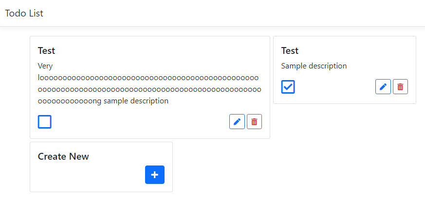

# Todo List

A simple ASP.NET MVC 6 TODO list web app.

## Description

The application allows adding, deleting and editing todo item cards. To mark item as COMPLETE click on empty box icon. Alternatively, to mark entry as INCOMPLETE click on checked box icon.

## Development Setup

0. It is recommended to use [Visual Studio 2022](https://visualstudio.microsoft.com/vs/) with `ASP.NET development workload` installed for quick local development setup. Otherwise, make sure you have [.Net CLI tools](https://docs.microsoft.com/en-us/dotnet/core/tools/) installed.

1. Clone project running `git clone` command in the terminal or by using application.

2. Make sure you have access to running SQL server (docker instance, locally hosted, etc.) and have a valid connection string. Add your SQL connection API Key by running `dotnet user-secrets set ConnectionStrings:TodoItemsConnection" "secret-key"`.

3. The application uses code-first approach with Entity Framework 6. The database can be updated using [Entity Framework Core tools](https://docs.microsoft.com/en-us/ef/core/cli/dotnet). Navigate to `./src/TodoListMvc` folder and run `dotnet ef database update` to update the database.

4. Run the command `dotnet restore` to install all the dependencies.

5. Run the command `dotnet build` to compile the project.

6. Run the command `dotnet run` to serve the project.

7. The application is running in <http://localhost>:{port}
